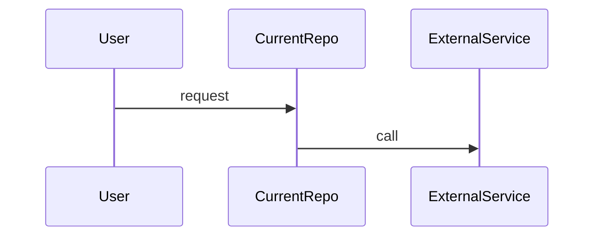

# 关键流程 / Critical Flows

Context Doc Type: critical-flows
Owner: project coordinator
Last Verified: unknown
Confidence: low

## Flow Index

| Flow ID | Name | Trigger | Services | Business Impact | Source Evidence | Last Verified | Confidence |
| --- | --- | --- | --- | --- | --- | --- | --- |

## Flow Template

下面只是示例。按真实业务选择 sequenceDiagram、flowchart 或 stateDiagram，不需要为每个任务强行画图。

