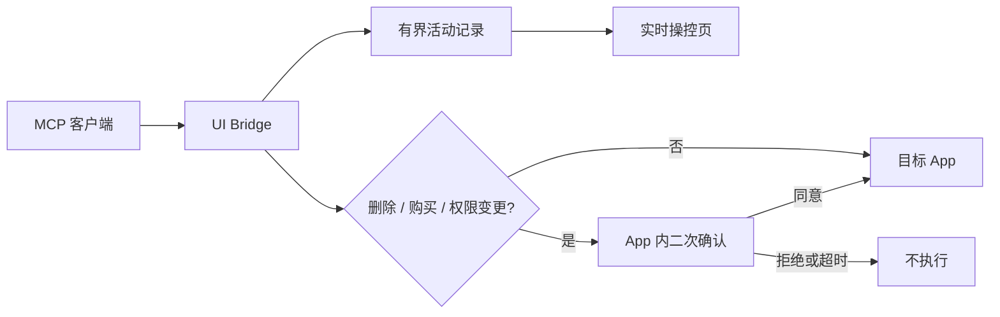

# Visual Map / 可视化图谱

Visual Map Contract: v1.0

本文件是任务图表集合，不只是阶段路线图。只有对人或 agent 理解任务有实际帮助的图才放进来。

## 图表索引（Map Index）

| ID | Type | Purpose | Required For Understanding | Source Evidence | Promotion Candidate |
| --- | --- | --- | --- | --- | --- |
| MAP-01 | phase | 展示执行阶段和依赖关系 | yes | `task_plan.md` | no |

## 阶段关系图（Phase Graph）

## 阶段表（Phase Table，表头供 checker 解析）

| Phase ID | Kind | Depends On | State | Completion | Output | Required Evidence | Exit Command | Actor | Evidence Status | Blocking Risk | Owner / Handoff |
| --- | --- | --- | --- | ---: | --- | --- | --- | --- | --- | --- | --- |
| INIT-01 | init | none | done | 100 | 任务计划和执行策略已确认 | `task_plan.md`; `execution_strategy.md` | `harness task-start 2026-07-14-item-65db687f` | agent | present | none | coordinator |
| EXEC-01 | execution | INIT-01 | done | 100 | 设置窗口、导航、总览和真实状态 | 构建、安装版窗口截图 | 无 | agent | present | none | coordinator |
| EXEC-02 | execution | EXEC-01 | done | 100 | 多应用真实画面、映射和事件 | 真实窗口截图、资源退出记录 | 无 | agent | present | none | coordinator |
| EXEC-03 | execution | EXEC-02 | done | 100 | 应用访问、安全确认和诊断 | 门禁自检、安装版拒绝/允许证据 | 无 | agent | present | none | coordinator |
| GATE-01 | gate | EXEC-03 | done | 100 | Agent Review Submission | `review.md`、progress update、lesson routing | 无 | agent | present | none | coordinator |
| GATE-02 | gate | GATE-01 | done | 100 | Human Review Confirmation | 用户逐项反馈与确认 | 无 | human | present | none | human |

允许的 `State`：`planned`, `in_progress`, `review`, `blocked`, `done`, `skipped`。

允许的 `Evidence Status`：`missing`, `partial`, `present`, `waived`。

允许的 `Kind`：`init`, `execution`, `gate`。

允许的 `Actor`：`agent`, `human`, `coordinator`。

`Completion` 使用 `0..100` 的整数；`done` 应为 `100`，`planned` 应为 `0`，`skipped` 不计入 dashboard 总完成度。dashboard 的实现完成度只由非 skipped 的 `execution` 阶段计算；`init` 和 `gate` 阶段表达生命周期门禁、下一步命令和责任人，不拉低实现完成度。

## 支持性图表（Supporting Maps）

按需添加，不要求每类都存在：

- architecture：模块、组件、服务结构。
- sequence：前端、后端、服务、数据库、agent 时序。
- data-flow：数据流转和所有权。
- state：状态机或生命周期。
- topology：repo、服务、worker、worktree 拓扑。
- decision：方案分叉和决策树。

